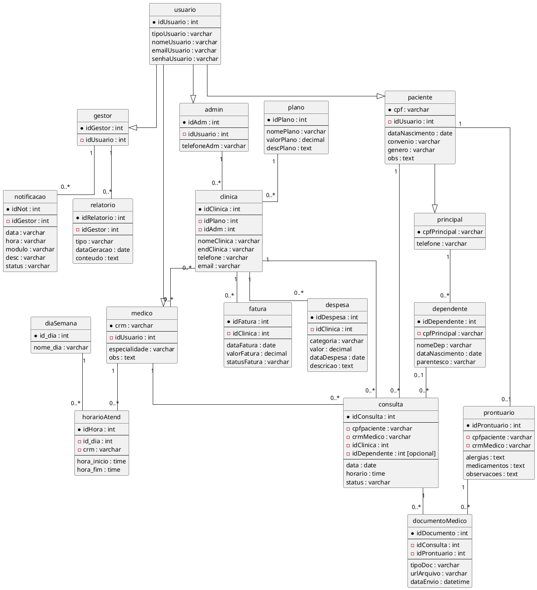

# Diagrama Entidade-Relacionamento

## Código

```plantuml
@startuml

hide circle
skinparam linetype ortho

entity "usuario" as usuario {
    * idUsuario : int
    --
    tipoUsuario : varchar
    nomeUsuario : varchar
    emailUsuario : varchar
    senhaUsuario : varchar
}

entity "gestor" as gestor {
    * idGestor : int
    --
    - idUsuario : int
}

entity "admin" as admin {
    * idAdm : int
    --
    - idUsuario : int
    --
    telefoneAdm : varchar
}

entity "medico" as medico {
    * crm : varchar
    --
    - idUsuario : int
    --
    especialidade : varchar
    obs : text
}

entity "paciente" as paciente {
    * cpf : varchar
    --
    - idUsuario : int
    --
    dataNascimento : date
    convenio : varchar
    genero : varchar
    obs : text
}

entity "principal" as principal {
    * cpfPrincipal : varchar
    --
    telefone : varchar
}

entity "dependente" as dependente {
    * idDependente : int
    --
    - cpfPrincipal : varchar
    --
    nomeDep : varchar
    dataNascimento : date
    parentesco : varchar
}

entity "notificacao" as notificacao {
    * idNot : int
    --
    - idGestor : int
    --
    data : varchar
    hora : varchar
    modulo : varchar
    desc : varchar
    status : varchar
}

entity "diaSemana" as diaSemana {
    * id_dia : int
    --
    nome_dia : varchar
}

entity "horarioAtend" as horarioAtend {
    * idHora : int
    --
    - id_dia : int
    - crm : varchar
    --
    hora_inicio : time
    hora_fim : time
}

entity "plano" as plano {
    * idPlano : int
    --
    nomePlano : varchar
    valorPlano : decimal
    descPlano : text
}

entity "clinica" as clinica {
    * idClinica : int
    --
    - idPlano : int
    - idAdm : int
    --
    nomeClinica : varchar
    endClinica : varchar
    telefone : varchar
    email : varchar
}

entity "fatura" as fatura {
    * idFatura : int
    --
    - idClinica : int
    --
    dataFatura : date
    valorFatura : decimal
    statusFatura : varchar
}

entity "despesa" as despesa {
    * idDespesa : int
    --
    - idClinica : int
    --
    categoria : varchar
    valor : decimal
    dataDespesa : date
    descricao : text
}

entity "relatorio" as relatorio {
    * idRelatorio : int
    --
    - idGestor : int
    --
    tipo : varchar
    dataGeracao : date
    conteudo : text
}

entity "consulta" as consulta {
    * idConsulta : int
    --
    - cpfpaciente : varchar
    - crmMedico : varchar
    - idClinica : int
    - idDependente : int [opcional]
    --
    data : date
    horario : time
    status : varchar
}

entity "prontuario" as prontuario {
    * idProntuario : int
    --
    - cpfpaciente : varchar
    - crmMedico : varchar
    --
    alergias : text
    medicamentos : text
    observacoes : text
}

entity "documentoMedico" as documentoMedico {
    * idDocumento : int
    --
    - idConsulta : int
    - idProntuario : int
    --
    tipoDoc : varchar
    urlArquivo : varchar
    dataEnvio : datetime
}

' HERANÇA
usuario --|> gestor
usuario --|> admin
usuario --|> medico
usuario --|> paciente

paciente --|> principal

' RELACIONAMENTOS
principal "1" -- "0..*" dependente
medico "1" -- "0..*" horarioAtend
diaSemana "1" -- "0..*" horarioAtend

plano "1" -- "0..*" clinica
admin "1" -- "0..*" clinica
gestor "1" -- "0..*" notificacao
gestor "1" -- "0..*" relatorio

clinica "1" -- "0..*" fatura
clinica "1" -- "0..*" despesa
clinica "0..*" -- "0..*" medico

paciente "1" -- "0..*" consulta
medico "1" -- "0..*" consulta
clinica "1" -- "0..*" consulta
dependente "0..1" -- "0..*" consulta

paciente "1" -- "0..1" prontuario
prontuario "1" -- "0..*" documentoMedico
consulta "1" -- "0..*" documentoMedico

@enduml
```
