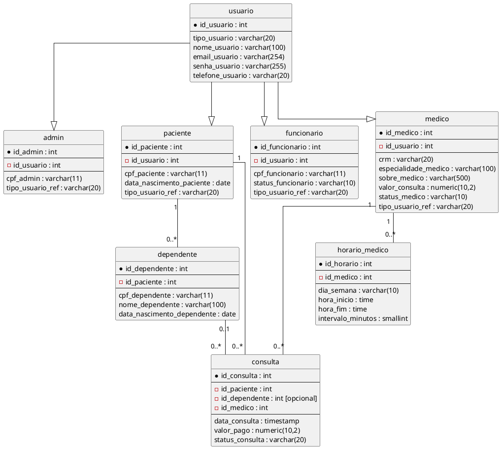

# Diagrama Entidade-Relacionamento

## Código

```plantuml
@startuml

hide circle
skinparam linetype ortho

entity "usuario" as usuario {
    * id_usuario : int
    --
    tipo_usuario : varchar(20)
    nome_usuario : varchar(100)
    email_usuario : varchar(254)
    senha_usuario : varchar(255)
    telefone_usuario : varchar(20)
}

entity "admin" as admin {
    * id_admin : int
    --
    - id_usuario : int
    --
    cpf_admin : varchar(11)
    tipo_usuario_ref : varchar(20)
}

entity "paciente" as paciente {
    * id_paciente : int
    --
    - id_usuario : int
    --
    cpf_paciente : varchar(11)
    data_nascimento_paciente : date
    tipo_usuario_ref : varchar(20)
}

entity "dependente" as dependente {
    * id_dependente : int
    --
    - id_paciente : int
    --
    cpf_dependente : varchar(11)
    nome_dependente : varchar(100)
    data_nascimento_dependente : date
}

entity "funcionario" as funcionario {
    * id_funcionario : int
    --
    - id_usuario : int
    --
    cpf_funcionario : varchar(11)
    status_funcionario : varchar(10)
    tipo_usuario_ref : varchar(20)
}

entity "medico" as medico {
    * id_medico : int
    --
    - id_usuario : int
    --
    crm : varchar(20)
    especialidade_medico : varchar(100)
    sobre_medico : varchar(500)
    valor_consulta : numeric(10,2)
    status_medico : varchar(10)
    tipo_usuario_ref : varchar(20)
}

entity "horario_medico" as horario_medico {
    * id_horario : int
    --
    - id_medico : int
    --
    dia_semana : varchar(10)
    hora_inicio : time
    hora_fim : time
    intervalo_minutos : smallint
}

entity "consulta" as consulta {
    * id_consulta : int
    --
    - id_paciente : int
    - id_dependente : int [opcional]
    - id_medico : int
    --
    data_consulta : timestamp
    valor_pago : numeric(10,2)
    status_consulta : varchar(20)
}

' HERANÇA (ESPECIALIZAÇÃO)
usuario --|> admin
usuario --|> paciente
usuario --|> funcionario
usuario --|> medico

' RELACIONAMENTOS
paciente "1" -- "0..*" dependente
paciente "1" -- "0..*" consulta
dependente "0..1" -- "0..*" consulta

medico "1" -- "0..*" horario_medico
medico "1" -- "0..*" consulta

@enduml
```
