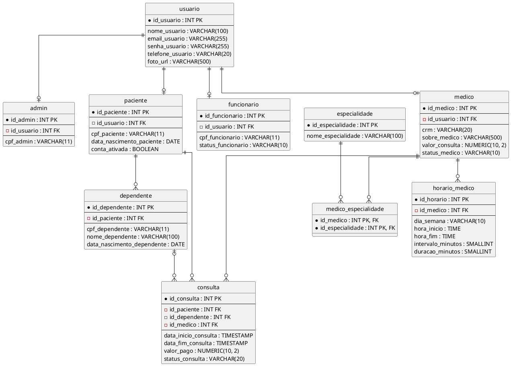

# Diagrama Entidade-Relacionamento

## Código

```plantuml
@startuml
skinparam linetype ortho
hide circle

entity "usuario" as usuario {
  * id_usuario : INT PK
  --
  nome_usuario : VARCHAR(100)
  email_usuario : VARCHAR(255)
  senha_usuario : VARCHAR(255)
  telefone_usuario : VARCHAR(20)
  foto_url : VARCHAR(500)
}

entity "admin" as admin {
  * id_admin : INT PK
  --
  - id_usuario : INT FK
  --
  cpf_admin : VARCHAR(11)
}

entity "paciente" as paciente {
  * id_paciente : INT PK
  --
  - id_usuario : INT FK
  --
  cpf_paciente : VARCHAR(11)
  data_nascimento_paciente : DATE
  conta_ativada : BOOLEAN
}

entity "dependente" as dependente {
  * id_dependente : INT PK
  --
  - id_paciente : INT FK
  --
  cpf_dependente : VARCHAR(11)
  nome_dependente : VARCHAR(100)
  data_nascimento_dependente : DATE
}

entity "funcionario" as funcionario {
  * id_funcionario : INT PK
  --
  - id_usuario : INT FK
  --
  cpf_funcionario : VARCHAR(11)
  status_funcionario : VARCHAR(10)
}

entity "medico" as medico {
  * id_medico : INT PK
  --
  - id_usuario : INT FK
  --
  crm : VARCHAR(20)
  sobre_medico : VARCHAR(500)
  valor_consulta : NUMERIC(10, 2)
  status_medico : VARCHAR(10)
}

entity "especialidade" as especialidade {
  * id_especialidade : INT PK
  --
  nome_especialidade : VARCHAR(100)
}

entity "medico_especialidade" as medico_especialidade {
  * id_medico : INT PK, FK
  * id_especialidade : INT PK, FK
}

entity "horario_medico" as horario_medico {
  * id_horario : INT PK
  --
  - id_medico : INT FK
  --
  dia_semana : VARCHAR(10)
  hora_inicio : TIME
  hora_fim : TIME
  intervalo_minutos : SMALLINT
  duracao_minutos : SMALLINT
}

entity "consulta" as consulta {
  * id_consulta : INT PK
  --
  - id_paciente : INT FK
  - id_dependente : INT FK
  - id_medico : INT FK
  --
  data_inicio_consulta : TIMESTAMP
  data_fim_consulta : TIMESTAMP
  valor_pago : NUMERIC(10, 2)
  status_consulta : VARCHAR(20)
}

' Especialização de usuario (1:1 via FK UNIQUE)
usuario ||--o| admin
usuario ||--o| paciente
usuario ||--o| funcionario
usuario ||--o| medico

' Relacionamentos N:N e 1:N
medico ||--o{ medico_especialidade
especialidade ||--o{ medico_especialidade

paciente ||--o{ dependente
medico ||--o{ horario_medico

paciente ||--o{ consulta
dependente |o--o{ consulta
medico ||--o{ consulta

@enduml
```
