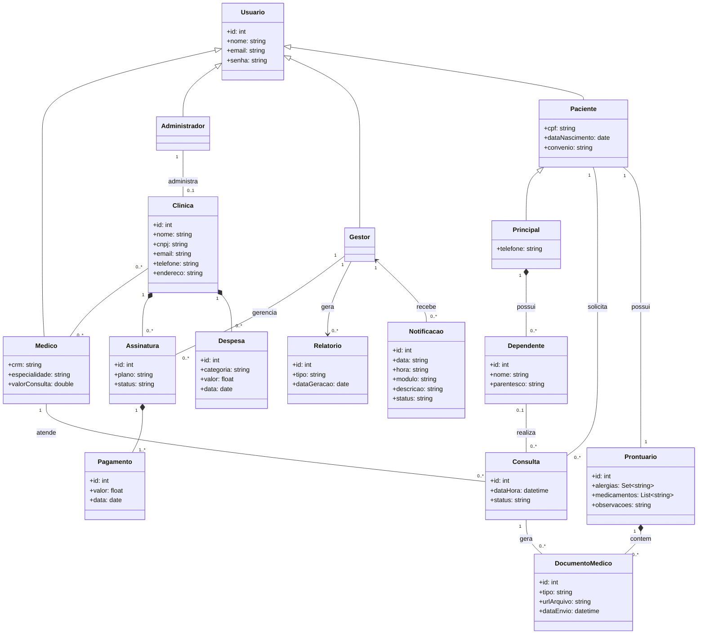

# Diagrama de Classes

```mermaid
classDiagram

%% ==================================================
%% PESSOAS E HIERARQUIA DE USUÁRIOS
%% ==================================================

class Usuario {
    +id: int
    +nome: string
    +email: string
    +senha: string
}

class Paciente {
    +cpf: string
    +dataNascimento: date
    +convenio: string
}

class Principal {
    +telefone: string
}

class Dependente {
    +id: int
    +nome: string
    +parentesco: string
}

class Medico {
    +crm: string
    +especialidade: string
    +valorConsulta: double
}

class Administrador
class Gestor

Usuario <|-- Medico
Usuario <|-- Administrador
Usuario <|-- Gestor
Usuario <|-- Paciente

Paciente <|-- Principal
Principal "1" *-- "0..*" Dependente : possui

%% ==================================================
%% ATENDIMENTO E PRONTUÁRIO
%% ==================================================

class Consulta {
    +id: int
    +dataHora: datetime
    +status: string
}

class Prontuario {
    +id: int
    +alergias: Set~string~
    +medicamentos: List~string~
    +observacoes: string
}

class DocumentoMedico {
    +id: int
    +tipo: string
    +urlArquivo: string
    +dataEnvio: datetime
}

Paciente "1" -- "0..*" Consulta : solicita
Dependente "0..1" -- "0..*" Consulta : realiza
Medico "1" -- "0..*" Consulta : atende
Paciente "1" -- "1" Prontuario : possui
Prontuario "1" *-- "0..*" DocumentoMedico : contem
Consulta "1" -- "0..*" DocumentoMedico : gera

%% ==================================================
%% CLÍNICA E FINANCEIRO
%% ==================================================

class Clinica {
    +id: int
    +nome: string
    +cnpj: string
    +email: string
    +telefone: string
    +endereco: string
}

class Assinatura {
    +id: int
    +plano: string
    +status: string
}

class Pagamento {
    +id: int
    +valor: float
    +data: date
}

class Despesa {
    +id: int
    +categoria: string
    +valor: float
    +data: date
}

Administrador "1" -- "0..1" Clinica : administra
Clinica "0..*" -- "0..*" Medico
Clinica "1" *-- "0..*" Assinatura
Assinatura "1" *-- "1..*" Pagamento
Clinica "1" *-- "0..*" Despesa
Gestor "1" -- "0..*" Assinatura : gerencia

%% ==================================================
%% RELATÓRIOS E ALERTAS
%% ==================================================

class Relatorio {
    +id: int
    +tipo: string
    +dataGeracao: date
}

class Notificacao {
    +id: int
    +data: string
    +hora: string
    +modulo: string
    +descricao: string
    +status: string
}

Gestor "1" --> "0..*" Relatorio : gera
Gestor "1" <-- "0..*" Notificacao : recebe
```
